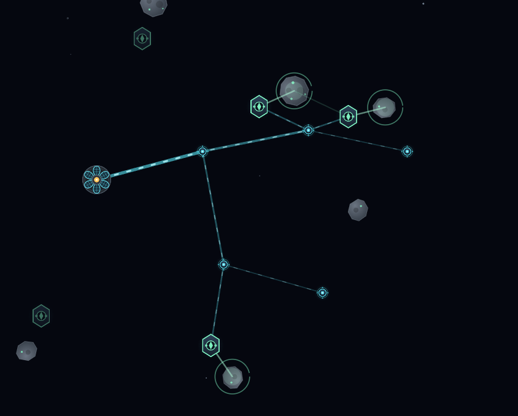
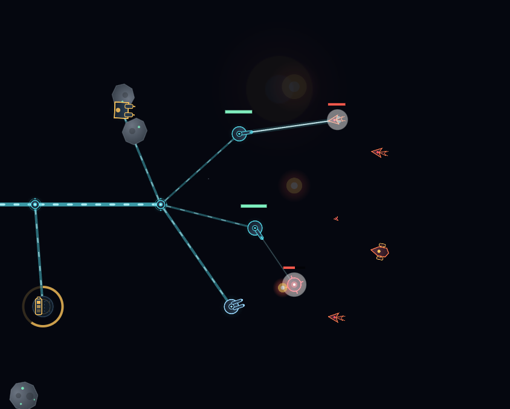
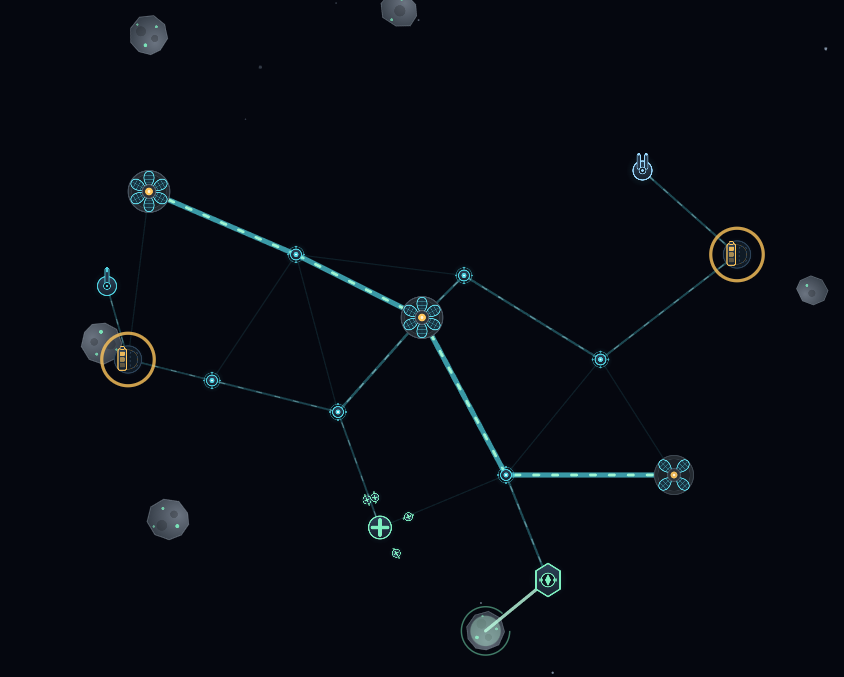
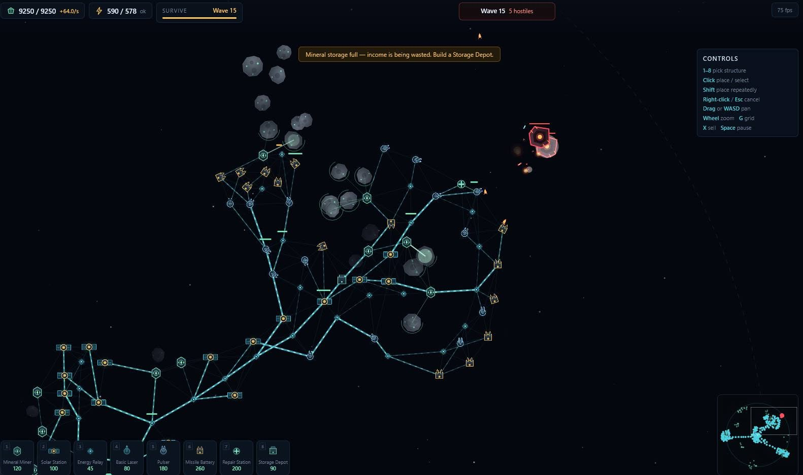

# Orbital Claim

A space mining and tower defense mini game

## The design

The interesting tension in this genre is that **your economy and your defence
compete for the same space**. Ore is where the asteroids are; asteroids are not
where it is safe. Everything below serves that.

Three systems, deliberately kept small:

1. **Ore.** Miners harvest asteroids in range. Asteroids are finite, so the
   field degrades and you are pushed outward over time.
2. **Power.** A live supply/demand balance, not a stockpile. Overdraw and
   *everything* slows proportionally — no instant failure, but a visible,
   fixable mistake. Relays cap at 6 links, so extending the grid outward is a
   real decision with a real cost.
3. **Threat.** Waves telegraph their bearing and composition during a build
   window. Enemy types are counters to specific lazy answers: missile ships
   outrange basic lasers, swarmers punish single-target turrets, exploders
   punish undefended edges, ring ships punish chip damage.

Balance data lives in [`web/assets/entities.json`](web/assets/entities.json) so
it can be tuned without touching code.

## Architecture

Plain ES modules, canvas 2D, no framework and no build step — open it and it
runs. That matters for a game meant to still work in fifteen years; the original
died precisely because it depended on a runtime and a server that went away.

```
web/
  index.html            asset sheet / preview (current state)
  serve.go              dev static server
  assets/
    sprites.svg         all art, as <symbol> defs
    entities.json       buildings, enemies, waves, modes
  src/                  (to come)
    main.js             bootstrap, canvas, resize
    loop.js             fixed-timestep update + interpolated render
    world.js            entity store, spatial hash for range queries
    grid.js             power network: links, connectivity, brownout
    economy.js          mining, ore, costs
    combat.js           targeting, projectiles, damage, splash
    waves.js            spawn director
    render.js           draw layers, sprite atlas blitting
    ui.js               build bar, selection, hotkeys, tooltips
    save.js             localStorage persistence
```

Two decisions worth stating up front:

- **Fixed timestep** (60 Hz) with interpolated rendering. An RTS with hundreds of
  units needs deterministic simulation; variable-dt physics makes balance
  irreproducible.
- **Spatial hash** for "everything in range", because nearly every system is a
  radius query (mining, targeting, repair, splash, grid links) and doing those
  naively is what makes browser RTS games stutter.

Sprites are authored as SVG and rasterised once into a canvas atlas at load, so
draws stay cheap while the source art stays editable.

## How to Play

The loop is simple: **mine asteroids, extend power, and survive the waves**.
You lose only when every structure is destroyed.

### Start of a run

1. Place **Mineral Miners** near asteroids to start ore income.
2. Place **Solar Stations** to increase supply.
3. Use **Energy Relays** to carry power outward to miners, turrets, batteries,
   and repair stations.
4. Add defenses before calling the next wave.

### What matters

- **Power is live, not stored.** If demand exceeds supply, the whole grid slows
  down instead of instantly failing.
- **Relays are the backbone.** Solars and relays can branch the network; miners
  and weapons are endpoints.
- **Asteroids deplete.** Safe inner rocks dry up, so expansion is part of the
  game.
- **Waves are telegraphed.** Watch the incoming direction and composition, then
  build the counter you need.
- **Weapon roles differ.** Lasers are steady and accurate, pulsers deliver high
  burst damage, and missile batteries hit groups but consume ore per shot.

### Controls

- **1-8** pick a structure from the build bar.
- **Click** places or selects.
- **Shift** places repeatedly.
- **Right-click** or **Esc** cancels.
- **Drag** or **WASD** pans the camera.
- **Mouse wheel** zooms.
- **G** toggles grid lines.
- **X** recycles the selected structure.
- **Space** pauses.
- **Enter** starts the next wave early.

The in-game animated tutorial is also available at [`web/tutorial.html`](web/tutorial.html).

## Screenshots

### Power and mining expansion



### Combat on the outer grid



### Power routing and logistics



### Late-game base state



## Roadmap

| # | Milestone | Done when |
|---|-----------|-----------|
| 0 | Assets and data | ✅ art, balance data, preview page, dev server |
| 1 | Field and camera | Asteroid field generates; pan/zoom; hub placed |
| 2 | Build and grid | Place structures, link range, connectivity, brownout |
| 3 | Economy | Miners deplete asteroids; ore accrues; costs enforced |
| 4 | Combat | ✅ turrets acquire and fire; projectiles; splash; shields; death |
| 5 | Waves | ✅ spawn director, telegraphing, build window, all 6 enemy types |
| 6 | Game feel | ✅ selection, range previews, sell/refund, pause, hotkeys |
| 7 | Modes | ✅ survival + mining race, mode menu, localStorage personal bests |
| 8 | Polish | Sound, particles, screen shake, tutorial |

Milestone 1 is the next piece of work.

## Build & Run

```bash
cd web && go run .
```

Then open http://localhost:8080. (`fetch` is blocked on `file://`, so the asset
sheet needs a real HTTP origin — hence the tiny server.)

To build a standalone binary:

```bash
cd web && go build -o serve.exe .
```

## License

MIT
